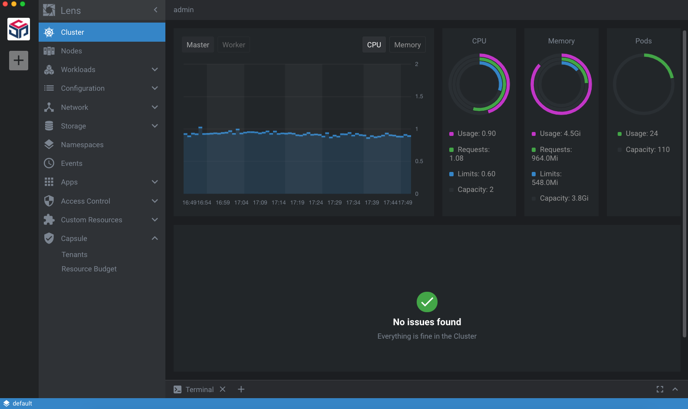
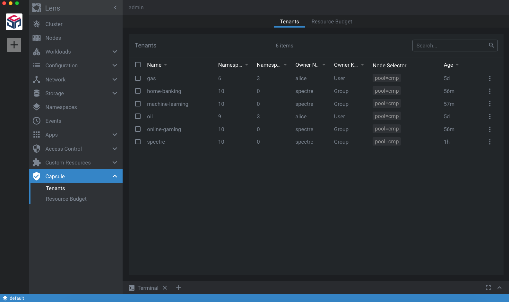
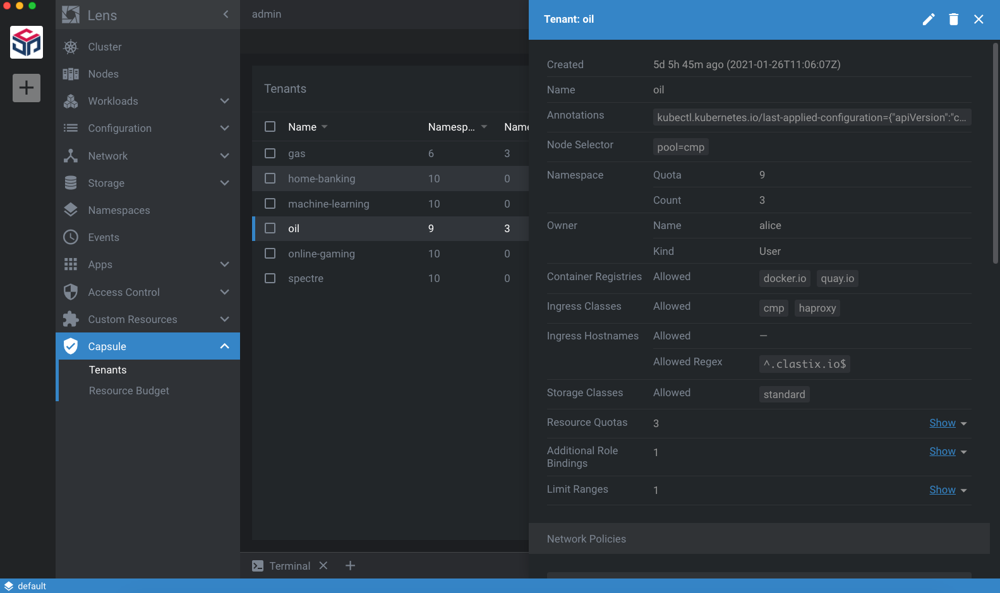
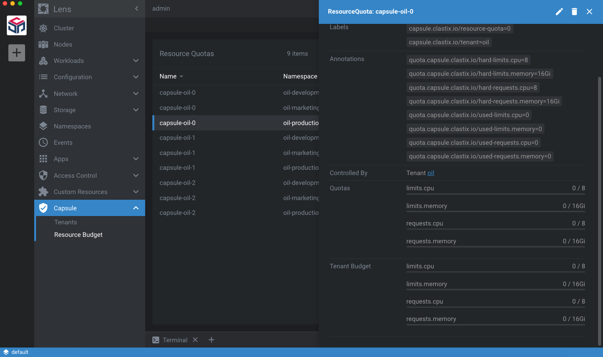
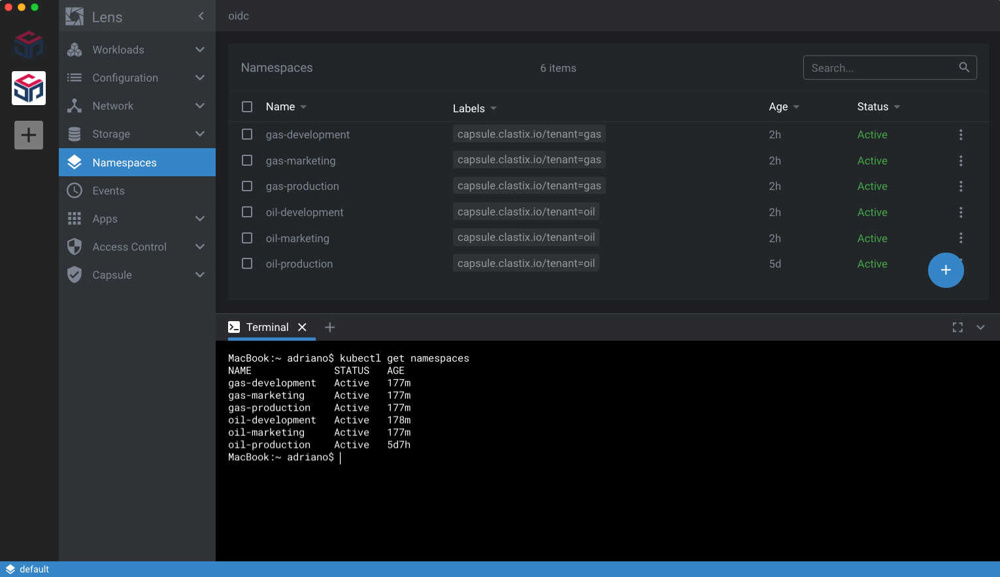

# Capsule Lens extension

This is a [Lens](https://github.com/lensapp/lens) extension for the [Capsule Operator](https://github.com/clastix/capsule) which provides advanced multi-tennancy and policy control on your Kubernetes cluster.

  
  

# Installation

This guide shows how to install the extension either from from pre-built release or source.

## Prerequisites

* Lens minimum [4.0.6](https://github.com/lensapp/lens/releases/tag/v4.0.6) should first be [installed](https://github.com/lensapp/lens#installation) on your workstation.
* Follow the [Capsule Getting Started](https://github.com/clastix/capsule/blob/master/docs/content/general/getting-started.md) guide to understand how to install the **Capsule Operator** in your Kubernetes cluster.
* Optionally, install the [Capsule Proxy](https://github.com/clastix/capsule-proxy) for an enhanced user experience for your tenant users. 

## From pre-built release
Lens extension for Capsule provides the tarball-file that can be manually
downloaded and installed. Alternatively, you can copy the download URL of the release artifact to paste it in the
**Manage Lens Extensions** page.

1. Download your desired version from GitHub [release](https://github.com/clastix/capsule-lens-extension/releases) page. Alternatively, just copy the download URL of the release artefact.
2. Open Lens application and select **Lens** menu, and then click **Extensions** item, or press
   <kbd>Shift</kbd> + <kbd>Command</kbd> + <kbd>E</kbd> to open the **Manage Lens Extensions** page.
3. Specify the path of the extension package `.tar`, `.tgz` or the download URL and click **Install**.
4. If everything is fine, you'll see the `@clastix/capsule-lens-extension` extension listed under
   **Installed Extensions**. Click **Enable** to enable it.
5. Close the **Manage Lens Extensions** page and verify that the **Capsule** menu item shows up in the main **Lens** menu.

## From source (Linux/MacOS)

1. Clone this repo.
2. `make build install` to build the extension and create a symlink.
3. Enable the extension in Lens **Extensions** as above.

## Development mode

1. Install the extension by following the steps above.
2. `make dev` to start webpack process in watch mode.
3. Press <kbd>Ctrl</kbd>+<kbd>R</kbd> in Lens to reload the extension after making changes.

# Getting Started

With Capsule extension for Lens, a cluster administrator can easly manage from a single pane of glass all resources of a Kubernetes cluster, including all the Tenants created through the Capsule Operator. Please, refer to the [documentation](https://github.com/clastix/capsule/blob/master/docs/content/index.md) about how Capsule can help to address multi-tanancy and policy control on your Kubernetes cluster.

### Tenants list
List all tenants:

### Tenant details
See the deatils of each tenant and change it through the embedded Lens editor:

### Resources Quota and Budget for all tenants 
Check the resources usage and quota at both the tenant and namespace level:

### Allowed namespaces list
If you installed the [Capsule Proxy](https://github.com/clastix/capsule-proxy), each tenant user can see only the namespaces he has access:

